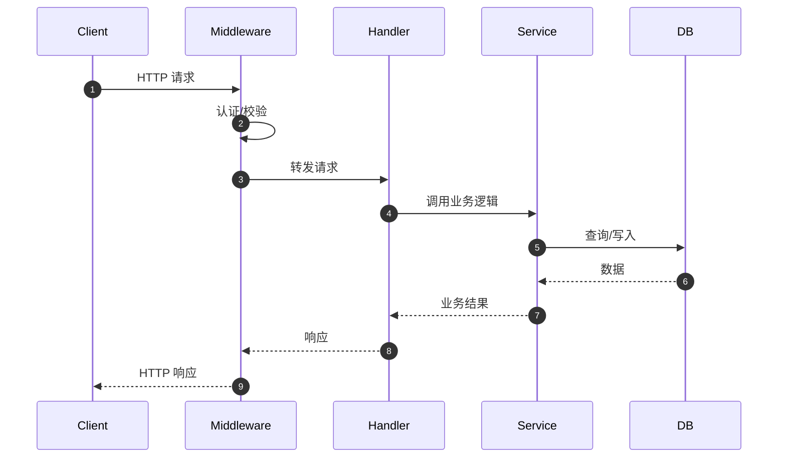
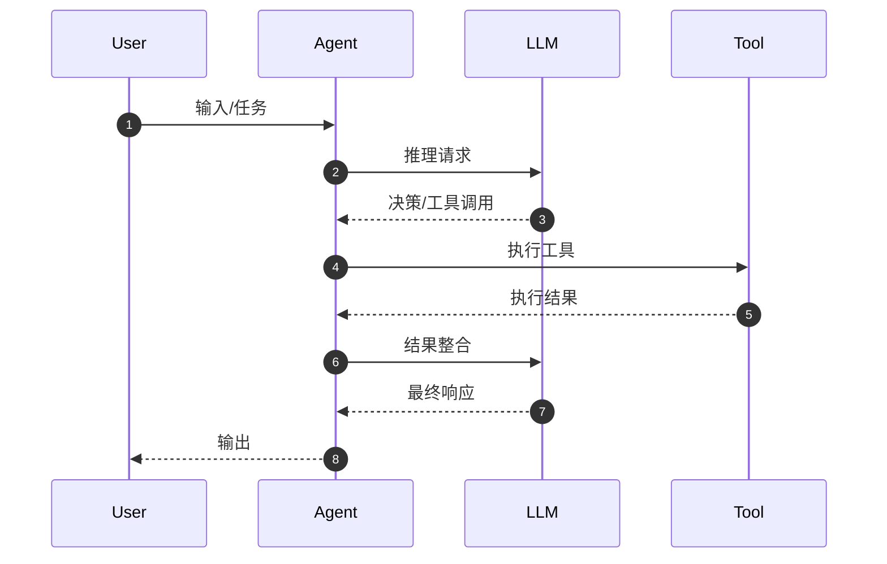

# 文档组件注册表

> 本文件定义所有可用的文档组件，供 AI 根据项目类型和模块特征动态选择并组装文档。

---

## 目录

1. [组件定义规范](#组件定义规范)
2. [组件清单](#组件清单)
3. [CodePurpose 组件映射](#codepurpose-组件映射)
4. [组件选择双层策略](#组件选择双层策略)
5. [时序图生成规范](#时序图生成规范)
6. [核心代码讲解规范](#核心代码讲解规范)

---

## 组件定义规范

每个组件必须定义以下 5 个属性：

| 属性 | 说明 | 示例 |
|------|------|------|
| **name** | 组件标识符 | `sequence-diagram` |
| **purpose** | 用途说明 | 展示请求处理链或数据流 |
| **format** | 输出格式 | Mermaid sequenceDiagram / 流程表格 |
| **trigger** | 触发条件（规则层） | CodePurpose in [Api, Service, Agent] |
| **fallback** | 降级策略 | 若 LLM 生成失败，使用流程表格替代 |

---

## 组件清单

### P0 级组件（必需）

#### overview

```yaml
name: overview
purpose: 模块概述，说明解决什么问题、为什么存在
format: 2-3 段文字 + 架构位置说明
trigger: 必需
fallback: 无
required_context:
  - 模块名和路径
  - CodePurpose
  - 依赖关系
  - 核心职责列表
output_example: |
  该模块负责用户认证流程，包括登录、登出和令牌刷新。
  
  采用策略模式支持多种认证方式（密码、OAuth、SAML），
  通过中间件链实现权限校验和会话管理。
  
  在整体架构中属于「业务逻辑层」，被 API 层调用，
  依赖用户服务和令牌管理模块。
```

---

#### api-table

```yaml
name: api-table
purpose: 公开接口总览
format: Markdown 表格
trigger: 必需
fallback: 无
required_context:
  - 导出声明
  - 函数签名
  - 参数类型
variants:
  - 接口表: | 接口 | 类型 | 描述 | 源码 |
  - 枚举表: | 枚举值 | 显示名 | 检测信号 |
  - 方法表: | 方法 | 用途 | 默认行为 |
  - 配置表: | 配置项 | 类型 | 默认值 | 描述 |
output_example: |
  | 接口 | 类型 | 描述 | 源码 |
  |------|------|------|------|
  | `login()` | 函数 | 用户登录 | [link](file://...) |
  | `logout()` | 函数 | 用户登出 | [link](file://...) |
  | `AuthService` | 类 | 认证服务 | [link](file://...) |
```

---

#### nav-links

```yaml
name: nav-links
purpose: 文档导航链接
format: Markdown 表格或列表
trigger: 必需
fallback: 无
required_context:
  - 相关文档路径
output_example: |
  | 文档 | 描述 |
  |------|------|
  | [架构](../architecture.md) | 系统架构 |
  | [API 参考](../api/auth.md) | 完整 API |
  | [用户模块](./user.md) | 相关模块 |
```

---

### P1 级组件（高优先级）

#### sequence-diagram

```yaml
name: sequence-diagram
purpose: 展示跨组件/模块的交互流程和时序
format:
  - 变体A: Mermaid sequenceDiagram（参与者 <= 6）
  - 变体B: 流程表格（参与者 > 6 或流水线）
  - 变体C: 文字步骤列表（简单线性流程）
trigger:
  - CodePurpose in [Api, Service, Agent, Entry, Command]
  - OR 模块有跨组件数据流
  - OR 函数调用链深度 >= 3
fallback:
  - 若参与者 > 8，拆分为多张子图
  - 若 LLM 生成失败，使用流程表格替代
required_context:
  - 接口签名
  - 依赖关系
  - 关键函数调用链
output_example_mermaid: |
  sequenceDiagram
    autonumber
    participant C as Client
    participant H as Handler
    participant S as Service
    participant DB as Database
    
    C->>H: POST /api/users
    H->>H: 参数校验
    H->>S: createUser()
    S->>DB: INSERT
    DB-->>S: User
    S-->>H: User
    H-->>C: 201 Created
output_example_table: |
  | 阶段 | 执行者 | 输入 | 输出 | 说明 |
  |------|--------|------|------|------|
  | 1 | Handler | Request | - | 参数校验 |
  | 2 | Service | UserDTO | User | 业务处理 |
  | 3 | Database | User | User | 持久化 |
```

---

#### code-walkthrough

```yaml
name: code-walkthrough
purpose: 对关键代码片段进行逐块讲解，解释"为什么这样实现"
format:
  - 格式A: 代码块 + 行内注释 + 逐块讲解表格
  - 格式B: 带注释代码 + 关键点说明
  - 格式C: 对比讲解（重构/优化场景）
trigger:
  - 函数复杂度 >= 50
  - OR CodePurpose in [Agent, Service, Api, Command]
  - OR 文件包含设计模式实现（单例、工厂、观察者等）
  - OR 核心算法（排序、搜索、状态机）
fallback:
  - 若 LLM 无法生成讲解，仅输出代码块 + 函数签名说明
required_context:
  - 完整函数代码（或截断后保留重要行）
  - 函数签名和参数说明
  - 调用关系
output_example: |
  ### 核心实现：calculate_importance_score
  
  ```python
  def calculate_file_importance(file_path, root_path, size):
      # ── 块1: 路径评分 ─────────────────────────────────
      rel_path = str(file_path.relative_to(root_path))
      if 'src' in Path(rel_path).parts:
          path_score = 1.0  # 核心源码优先
      else:
          path_score = 0.5
      
      # ── 块2: 加权融合 ─────────────────────────────────
      return path_score * 0.5 + identity_score * 0.5
  ```
  
  **逐块讲解**：
  
  | 代码块 | 行号 | 职责 | 设计意图 |
  |--------|------|------|----------|
  | 路径评分 | L2-6 | 根据文件位置评估 | 核心源码目录优先 |
  | 加权融合 | L8-9 | 合并维度分数 | 均衡多因素影响 |
```

---

#### architecture-diagram

```yaml
name: architecture-diagram
purpose: 展示系统/模块的层次结构
format: Mermaid flowchart TB
trigger:
  - 模块包含 2+ 子模块
  - OR CodePurpose in [Entry, Page, Command]
  - OR 文件结构深度 >= 2
fallback:
  - 若模块简单，用文字列表描述层次
required_context:
  - 模块列表和依赖关系
  - 文件结构
output_example: |
  flowchart TB
    subgraph Core["Core Layer"]
      A["Service"]
      B["Repository"]
    end
    subgraph Api["API Layer"]
      C["Handler"]
      D["Middleware"]
    end
    D --> C
    C --> A
    A --> B
```

---

### P2 级组件（中优先级）

#### class-diagram

```yaml
name: class-diagram
purpose: 展示类/接口的继承和组合关系
format: Mermaid classDiagram
trigger:
  - 模块导出 class/struct/interface
  - OR 存在继承关系（extends/implements）
fallback:
  - 若无继承关系，用接口表格代替
required_context:
  - 类定义和属性
  - 方法签名
  - 继承关系
output_example: |
  classDiagram
    class AuthService {
      +login(username, password) Token
      +logout(token) void
      -validateToken(token) bool
    }
    class OAuthProvider {
      <<interface>>
      +authenticate(credentials) User
    }
    AuthService ..|> OAuthProvider : implements
```

---

#### state-diagram

```yaml
name: state-diagram
purpose: 展示状态机或生命周期
format: Mermaid stateDiagram-v2
trigger:
  - CodePurpose == Agent
  - OR 显式状态管理（useState/useReducer/状态模式）
  - OR 生命周期方法（onMount/onDestroy 等）
fallback:
  - 用文字列表描述状态和转换条件
required_context:
  - 状态变量定义
  - 状态转换触发条件
output_example: |
  stateDiagram-v2
    [*] --> Idle
    Idle --> Thinking: receive_input
    Thinking --> Executing: decide_action
    Executing --> Thinking: need_more_info
    Executing --> Responding: action_complete
    Responding --> Idle: send_response
```

---

#### dependency-diagram

```yaml
name: dependency-diagram
purpose: 展示模块间的依赖方向
format: Mermaid flowchart LR
trigger:
  - 模块有内部依赖或被其他模块依赖
  - OR 依赖数 >= 2
fallback:
  - 用依赖表格代替
required_context:
  - import 语句
  - 模块依赖关系
output_example: |
  flowchart LR
    A["API"] --> B["Service"]
    A --> C["Middleware"]
    B --> D["Repository"]
    B --> E["Cache"]
    C --> B
```

---

#### decision-table

```yaml
name: decision-table
purpose: 展示策略选择、条件分支、决策逻辑
format: Markdown 表格
trigger:
  - 存在多层处理策略
  - OR 有条件分支逻辑
  - OR 需要对比不同方案
fallback:
  - 用列表替代
required_context:
  - 决策条件
  - 各分支结果
output_example: |
  | Layer | 方法 | 触发条件 | 延迟 | 成本 |
  |-------|------|---------|------|------|
  | 1 | map_by_rules() | 始终优先 | ~0ms | 免费 |
  | 2 | llm_extract() | Layer1返回Other | ~1-3s | 有成本 |
```

---

#### code-example

```yaml
name: code-example
purpose: 展示使用方法
format: 代码块 + 场景说明
trigger:
  - 模块复杂度 >= 低
  - OR 公开接口 >= 1
fallback:
  - 若 LLM 无法生成，仅输出基本调用示例
required_context:
  - 模块公开接口
  - 典型使用场景
output_example: |
  ### 示例：用户登录
  
  ```python
  from auth import AuthService
  
  service = AuthService()
  token = service.login("user@example.com", "password")
  print(f"Token: {token}")
  ```
```

---

### P3 级组件（低优先级）

#### error-table

```yaml
name: error-table
purpose: 错误类型及处理方式
format: Markdown 表格
trigger:
  - 模块定义自定义错误类型
  - OR 函数签名包含 throws/Result/Error
  - OR CodePurpose in [Api, Service, Agent, Dao]
fallback:
  - 若无显式错误定义，跳过
required_context:
  - 错误类型定义
  - 异常抛出点
output_example: |
  | 错误 | 触发条件 | 处理建议 |
  |------|---------|---------|
  | `AuthFailed` | 凭证无效 | 检查用户名密码 |
  | `TokenExpired` | 令牌过期 | 调用 refresh_token() |
```

---

#### file-structure

```yaml
name: file-structure
purpose: 展示模块文件组织
format: 目录树 + 职责表
trigger:
  - 模块包含 2+ 源文件
fallback:
  - 单文件模块用一句话说明
required_context:
  - 文件列表
  - 每个文件的导出内容
output_example: |
  ```
  auth/
  ├── service.py      # 认证服务入口
  ├── oauth.py        # OAuth 实现
  └── token.py        # 令牌管理
  ```
  
  | 文件 | 职责 | 导出 |
  |------|------|------|
  | `service.py` | 认证服务入口 | AuthService |
  | `oauth.py` | OAuth 实现 | OAuthProvider |
```

---

#### usage-patterns

```yaml
name: usage-patterns
purpose: 典型使用场景和模式
format: 场景描述 + 代码 + 预期结果
trigger:
  - 模块复杂度 >= 中等
  - OR 公开接口 >= 3
  - OR CodePurpose in [SDK, Util, Service]
fallback:
  - 用多个 code-example 代替
required_context:
  - 模块公开接口
  - 业务场景
output_example: |
  ### 模式 1：带缓存的认证
  
  **场景**：高频调用时减少数据库查询
  
  ```python
  service = AuthService(cache=RedisCache())
  token = service.login(username, password)
  ```
  
  **预期**：首次查询后缓存用户信息 5 分钟
```

---

## CodePurpose 组件映射

### 映射表

| CodePurpose | 默认组件集 | sequence-diagram | code-walkthrough |
|-------------|-----------|:----------------:|:----------------:|
| **Entry** | overview → architecture-diagram → sequence-diagram → nav-links | ✅ 必需 | 可选 |
| **Agent** | overview → sequence-diagram → code-walkthrough → state-diagram → nav-links | ✅ 必需 | ✅ 必需 |
| **Page** | overview → architecture-diagram → api-table → code-example → nav-links | 可选 | 可选 |
| **Widget** | overview → api-table → code-example → nav-links | - | 可选 |
| **Service** | overview → api-table → sequence-diagram → code-walkthrough → nav-links | ✅ 必需 | ✅ 必需 |
| **Api** | overview → api-table → sequence-diagram → code-walkthrough → error-table → nav-links | ✅ 必需 | ✅ 必需 |
| **Dao** | overview → api-table → nav-links | 可选 | 可选 |
| **Model** | overview → class-diagram → api-table → nav-links | - | - |
| **Config** | overview → api-table → nav-links | - | - |
| **Database** | overview → erDiagram → nav-links | 可选 | 可选 |
| **Util** | overview → api-table → code-example → nav-links | - | 可选 |
| **Command** | overview → architecture-diagram → api-table → code-example → nav-links | 可选 | 可选 |
| **Other** | overview → api-table → nav-links | AI 推荐 | AI 推荐 |

### 图例

- ✅ 必需：该 CodePurpose 下必须生成此组件
- 可选：根据实际内容判断是否生成
- AI 推荐：由第二层 AI 分析决定
- `-`：通常不需要

---

## 组件选择双层策略

### 第一层：规则触发（快速、确定性）

**执行时机**：读取 structure.json 后立即执行  
**输入**：CodePurpose、复杂度、依赖数、文件结构  
**输出**：必需组件列表 + 条件组件候选

**规则示例**：

```
IF CodePurpose == Agent:
  components = [overview, sequence-diagram, code-walkthrough, state-diagram, nav-links]
  
IF CodePurpose == Api:
  components = [overview, api-table, sequence-diagram, code-walkthrough, error-table, nav-links]
  
IF has_class_definition:
  components.append(class-diagram)
  
IF complexity >= 50:
  components.append(code-walkthrough)
  
IF dependency_count >= 2:
  components.append(dependency-diagram)
```

### 第二层：AI 推荐（补充、语义性）

**执行时机**：深度阅读源码后  
**输入**：源码内容、第一层结果、项目上下文  
**输出**：推荐组件列表 + 生成参数

**AI Prompt 模板**：

```
分析以下模块，推荐应生成的文档组件：

模块：{module_name}
用途：{code_purpose}
复杂度：{complexity}
核心职责：{responsibilities}

已选组件：{selected_components}

可选组件：[usage-patterns, error-table, file-structure, decision-table]

请返回 JSON：
{
  "add_components": ["组件名", ...],
  "remove_components": ["组件名", ...],
  "reasoning": "原因说明"
}
```

### 降级策略

| 组件 | LLM 失败时的降级方案 |
|------|---------------------|
| sequence-diagram | 输出流程表格或文字步骤列表 |
| code-walkthrough | 仅输出代码块 + 函数签名 |
| architecture-diagram | 输出层次文字列表 |
| class-diagram | 输出接口表格 |
| state-diagram | 输出状态转换文字表格 |
| usage-patterns | 合并到 code-example |
| 其他表格组件 | 使用静态分析结果填充 |

---

## 时序图生成规范

### 触发条件矩阵

| 模块特征 | 必需 | 推荐 | 跳过 |
|---------|:----:|:----:|:----:|
| API 端点/路由处理 | ✅ | | |
| 中间件链 | ✅ | | |
| Agent 决策流程 | ✅ | | |
| 多 Agent 协作 | ✅ | | |
| 前后端交互 | ✅ | | |
| 数据库操作 | | ✅ | |
| 状态管理 | | ✅ | |
| 简单工具函数 | | | ✅ |

### 格式选择规则

| 条件 | 使用格式 |
|------|---------|
| 参与者 <= 6 | Mermaid sequenceDiagram |
| 参与者 > 6 或流水线 | 流程表格 |
| 简单线性流程 | 文字步骤列表 |

### Mermaid 模板

**请求处理链**：



**Agent 决策流程**：



### 流程表格模板

| 阶段 | 执行者 | 输入 | 输出 | 说明 |
|------|--------|------|------|------|
| 1 | Middleware | Request | - | 认证校验 |
| 2 | Handler | Request | DTO | 参数解析 |
| 3 | Service | DTO | Entity | 业务处理 |
| 4 | Repository | Entity | Entity | 持久化 |
| 5 | Handler | Entity | Response | 响应构建 |

---

## 核心代码讲解规范

### 触发条件

| 条件 | 必须 | 推荐 | 跳过 |
|------|:----:|:----:|:----:|
| 函数复杂度 >= 50 | ✅ | | |
| CodePurpose in [Agent, Service, Api, Command] | ✅ | | |
| 设计模式实现 | ✅ | | |
| 核心算法 | ✅ | | |
| 入口文件启动流程 | | ✅ | |
| 简单工具函数（<10 行） | | | ✅ |
| 纯数据结构定义 | | | ✅ |

### 格式选择

| 场景 | 格式 |
|------|------|
| 代码可划分为 3-6 个逻辑块 | 格式A：代码块 + 逐块讲解表格 |
| 代码逻辑连贯，难以分块 | 格式B：带注释代码 + 关键点说明 |
| 重构/优化场景 | 格式C：对比讲解 |

### 格式A 模板

```markdown
### 核心实现：{FUNCTION_NAME}

```{lang}
def example_function():
    # ── 块1: 参数校验 ─────────────────────────────────
    ...
    
    # ── 块2: 核心逻辑 ─────────────────────────────────
    ...
    
    # ── 块3: 结果处理 ─────────────────────────────────
    ...
```

**逐块讲解**：

| 代码块 | 行号 | 职责 | 设计意图 |
|--------|------|------|----------|
| 参数校验 | L1-5 | 验证输入合法性 | 前置校验，快速失败 |
| 核心逻辑 | L6-20 | 处理业务逻辑 | 使用策略模式支持扩展 |
| 结果处理 | L21-28 | 格式化输出 | 统一响应格式 |
```

### 格式B 模板

```markdown
### 核心实现：{FUNCTION_NAME}

```python
def agent_decide(self, context):
    # 1️⃣ 提取意图特征
    features = self._extract_features(context)
    
    # 2️⃣ LLM 推理（核心决策点）
    response = self.llm.invoke(prompt)  # ⚠️ 可能失败，需重试
    
    # 3️⃣ 解析并校验输出
    action = self._parse_response(response)
    if not self._validate(action):  # 🔒 安全校验
        return self._fallback()
    return action
```

**关键点说明**：

1. **意图特征提取**（L2）：将用户输入转换为结构化特征，降低 LLM 提示词复杂度
2. **LLM 推理**（L4-5）：核心决策点，使用 Retry 机制处理网络错误
3. **输出校验**（L7-8）：防止 LLM 幻觉产生非法 Action，保障系统安全
```

### 格式C 模板（对比讲解）

```markdown
### 设计演进：{FEATURE_NAME}

#### 方案 A（原始实现）

```python
def process(items):
    result = []
    for item in items:
        result.append(transform(item))  # ❌ 每次追加
    return result
```

**问题**：列表追加在大数据量下性能差

#### 方案 B（优化实现）

```python
def process(items):
    return [transform(item) for item in items]  # ✅ 列表推导
```

**改进**：预分配内存，性能提升 ~30%
```
