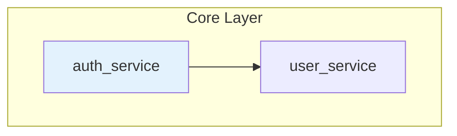

# Wiki 页面模板

本文件定义文档的**骨架结构**，具体内容由 AI 根据 [`components.md`](components.md) 中的组件注册表动态组装。

> **核心变化**：模板不再使用固定占位符，而是基于 CodePurpose 和模块特征选择组件。

---

## 目录

1. [模板设计原则](#模板设计原则)
2. [概览文档骨架](#概览文档骨架)
3. [模块文档骨架](#模块文档骨架)
4. [API 文档骨架](#api-文档骨架)
5. [快速开始骨架](#快速开始骨架)
6. [文档地图骨架](#文档地图骨架)
7. [menu.json 模板](#menujson-模板)
8. [源码追溯要求](#源码追溯要求)
9. [Mermaid 规范](#mermaid-规范)

---

## 模板设计原则

### 组件化组装

```
文档 = 骨架 + 组件集合

骨架：定义文档的基本结构（标题、分隔线、必需章节）
组件：根据 CodePurpose 和模块特征动态选择
```

### 条件章节规则

标注 `（条件：…）` 的章节，仅当条件满足时生成。条件不满足时直接跳过，不要生成空壳内容。

### 语言适配

所有代码示例使用**项目的主要编程语言**。将通用占位符替换为目标项目的实际语法。

### 组件引用

所有组件定义详见 [`components.md`](components.md)。关键组件：

| 组件 | 用途 | 优先级 |
|------|------|:------:|
| `overview` | 模块概述 | P0 |
| `api-table` | 接口总览 | P0 |
| `nav-links` | 导航链接 | P0 |
| `sequence-diagram` | 时序图 | P1 |
| `code-walkthrough` | 核心代码讲解 | P1 |
| `architecture-diagram` | 架构图 | P1 |
| `class-diagram` | 类图 | P2 |
| `state-diagram` | 状态图 | P2 |
| `dependency-diagram` | 依赖图 | P2 |
| `decision-table` | 决策表 | P2 |
| `code-example` | 代码示例 | P2 |
| `error-table` | 错误处理表 | P3 |
| `file-structure` | 文件结构 | P3 |
| `usage-patterns` | 使用模式 | P3 |

---

## 概览文档骨架

> 对应输出文件 `overview.md`。以架构为主线，融入项目定位和文档导航。

```markdown
# {PROJECT_NAME}

[徽章：技术栈、版本、语言等]

> {一句话定位}

---

## 项目概述

[overview 组件：项目解决的核心问题、适用场景、关键设计理念]

---

## 技术栈

[api-table 组件：语言/框架/工具 三列表格]

---

## 系统架构

[architecture-diagram 组件：flowchart TB 分层架构图，P0 必需]

[分层说明：每层职责一句话，来自第 5 步 RelationshipSummary]

---

## 模块说明

[对每个模块：名称（链接到模块文档）、职责一句话、关键依赖]

---

## 数据流（条件：项目涉及 API 调用或跨组件数据传递）

[sequence-diagram 组件：展示最核心的一条调用链]

---

## 模块依赖图（条件：模块数 ≥ 4）

[dependency-diagram 组件：flowchart LR]

---

## 目录结构（条件：项目目录结构非平凡）

[file-structure 组件]

---

## 文档导航

[nav-links 组件：getting-started.md、doc-map.md、各模块文档入口]
```

---

## 模块文档骨架

> **重要**：模块文档的组件选择基于 CodePurpose。详见 [`components.md`](components.md) 的"CodePurpose 组件映射"章节。

```markdown
# {MODULE_NAME}

> {模块一句话描述}

---

## 概述

[overview 组件：模块职责、设计理念、架构位置]

---

## 核心类与函数（条件：模块包含 class/struct/interface/enum 定义）

[class-diagram 组件：展示类关系]

---

## 文件结构（条件：模块包含 2+ 源文件）

[file-structure 组件：目录树 + 职责表]

---

## 公开接口

[api-table 组件：接口总览表]

---

## 请求/数据处理流程（条件：CodePurpose in [Api, Service, Agent, Entry]）

[sequence-diagram 组件：展示处理链]

---

## 核心实现（条件：复杂度 >= 50 或 CodePurpose in [Agent, Service, Api]）

[code-walkthrough 组件：关键代码讲解]

---

## 状态管理（条件：有显式状态管理）

[state-diagram 组件：状态机或生命周期]

---

## 依赖关系（条件：有内部依赖或被依赖）

[dependency-diagram 组件：依赖图 + 依赖表]

---

## 错误处理（条件：有自定义错误类型）

[error-table 组件：错误类型 + 处理方式]

---

## 代码示例

[code-example 组件：使用示例]

---

## 相关文档

[nav-links 组件]

---

[<- 返回模块列表](_index.md) | [API 参考 ->](../api/{MODULE_NAME}.md)
```

### CodePurpose → 组件映射

> 完整映射表详见 [`components.md`](components.md) 的"CodePurpose 组件映射"章节。

---

## API 文档骨架

```markdown
# API 参考：{MODULE_NAME}

> {模块描述}

---

## 概述

[overview 组件：模块用途 + 导入方式]

### 导入

[code-example 组件：导入语句]

### 快速示例

[code-example 组件：最小调用示例]

---

## 接口概览

[api-table 组件：接口总览表]

---

## 类型定义（条件：模块导出自定义类型）

[api-table 变体：类型字段表]

---

## 函数详解（条件：模块导出函数）

### `{FUNCTION_NAME}` [源码](file://...)

[code-walkthrough 组件或简化版：函数签名 + 参数表 + 返回值 + 示例]

---

## 类详解（条件：模块导出类）

### `{CLASS_NAME}` [源码](file://...)

[class-diagram 组件：类关系]

[api-table 变体：构造函数、属性、方法]

---

## 使用模式（条件：模块复杂度 >= 中等）

[usage-patterns 组件：典型场景]

---

## 常见问题（条件：有非显而易见的使用注意事项）

[Q&A 格式]

---

## 相关文档

[nav-links 组件]

---

[<- 返回 API 列表](_index.md) | [模块文档 ->](../modules/{MODULE_NAME}.md)
```

---

## 快速开始骨架

```markdown
# 快速开始

> 在几分钟内启动并运行 {PROJECT_NAME}

---

## 前置条件

[api-table 变体：依赖表格]

---

## 安装

### 通过包管理器安装（推荐）

[code-example 组件：安装命令]

### 从源码安装

[code-example 组件：克隆 + 构建]

### 验证安装

[code-example 组件：版本检查]

---

## 基本用法

[code-example 组件：最小可运行示例]

---

## 下一步

[nav-links 组件：指向相关文档]

---

## 常见问题

[Q&A 格式：安装问题、配置问题]
```

---

## 文档地图骨架

```markdown
# 文档地图

> {PROJECT_NAME} 文档导航与阅读路径

---

## 文档结构图

[architecture-diagram 变体：文档层级图]

---

## 阅读路径推荐

### 新手入门

[步骤列表：首页 → 快速开始 → 核心模块]

### 架构理解

[步骤列表：架构文档 → 模块文档 → 设计决策]

### API 查阅

[步骤列表：API 索引 → 具体 API → 使用示例]

---

## 文档索引

[api-table 变体：按类别列出所有文档]

---

## 模块依赖矩阵

[decision-table 变体：模块依赖关系]

---

## 更新日志

[链接或简要说明]
```

---

## menu.json 模板

> `menu.json` 定义整个 wiki 的导航层级。由步骤 7 生成，步骤 8 引用各模块在菜单中的位置生成面包屑和前后链接。

### JSON 结构

```json
{
  "version": "1.0",
  "generated_at": "2024-01-01T00:00:00Z",
  "sections": [
    {
      "id": "overview",
      "title": "概览",
      "fixed": true,
      "items": [
        { "id": "home",         "title": "首页",     "path": "index.md" },
        { "id": "architecture", "title": "架构总览", "path": "architecture.md" },
        { "id": "doc-map",      "title": "文档地图", "path": "doc-map.md" },
        { "id": "quickstart",   "title": "快速开始", "path": "quick-start.md" }
      ]
    },
    {
      "id": "auth",
      "title": "认证与鉴权",
      "items": [
        { "id": "auth-core",    "title": "认证核心",   "path": "modules/auth.md" },
        { "id": "permissions",  "title": "权限模型",   "path": "modules/permissions.md" }
      ]
    },
    {
      "id": "contributing",
      "title": "贡献指南",
      "fixed": true,
      "items": [
        { "id": "contributing", "title": "贡献指南", "path": "contributing.md" }
      ]
    }
  ]
}
```

**字段说明：**

| 字段 | 类型 | 说明 |
|------|------|------|
| `sections[].id` | string | 分区唯一标识（英文，用于锚点） |
| `sections[].title` | string | 面向读者的语义名称（中文或英文） |
| `sections[].fixed` | boolean | `true` = 首尾固定区块，步骤 7 不得调整顺序 |
| `items[].id` | string | 条目唯一标识 |
| `items[].title` | string | 导航显示名称 |
| `items[].path` | string | 相对 `wiki/` 目录的文件路径 |
| `items[].planned` | boolean | `true` = 文档尚未生成（增量模式占位），默认 `false` |

### AI 生成菜单 5 条规则

1. **按读者旅程排序**：首区块"概览"→ 核心业务模块 → 周边模块 → 尾区块"贡献指南"
2. **语义命名**：`title` 面向读者（"认证与鉴权"），不使用路径（"src/auth"）或 CodePurpose 枚举（"Service"）
3. **层级不超过 3 级**：`sections > items`（最多再加一层 `sub-items`），避免深层嵌套
4. **固定首尾**：`"fixed": true` 的 Overview 区块始终最前，Contributing 区块始终最后
5. **增量占位**：增量更新时已知但未生成的文档，添加 `"planned": true`，不留空条目

---

## 源码追溯要求

每个章节末尾应包含源码引用：

```markdown
**Section sources**
- [filename.ts](file:///path/to/filename.ts#L10-L50)
- [another.ts](file:///path/to/another.ts#L20-L80)
```

格式：`[文件名](file://绝对路径#L起始行-L结束行)`

---

## Mermaid 规范

| 规则 | 说明 |
|------|------|
| 节点 ID | 仅用字母数字下划线，禁止中文 |
| 中文标签 | 用双引号包裹：`A["中文标签"]` |
| 颜色区分 | 使用 `style` 定义不同模块类型颜色 |
| 点击链接 | 使用 `click` 添加文档跳转 |

示例：


