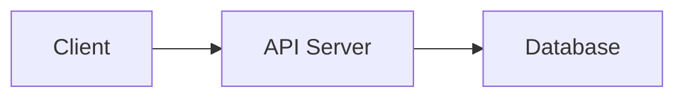

# generate-module-docs 执行策略

> 本文档对应工作流generate-module-docs详细文档生成阶段，涵盖：模块优先级排序、并行/串行调度、失败重试、断点续传、内容降级策略和知识库导出。


## 契約

| 項 | 値 |
|----|-----|
| **脚本** | `python scripts/generate_menu.py ... --reconcile`、`fix_mermaid.py`、`check_quality.py` |
| **输入** | `cache/module-analysis.json`、`wiki/menu.json`、RelationshipSummary |
| **输出** | `wiki/modules/*.md`、`wiki/api/*.md`、`wiki/menu.json`（校验后） |
| **前置** | `generate-menu` |
| **后置** | 完成 |
| **生成规则** | 见 `../generation/module-page.md`、`../generation/api-page.md` |

## 模块优先级排序

生成前对模块进行排序，高优先级模块优先处理：

| 优先级 | 类别 | 示例 | 原因 |
|-------|------|------|------|
| 1（最高） | `core` | 入口点、框架代码、被大量依赖 | 理解其余部分的基础 |
| 2 | `api` | 公共接口、客户端库、SDK | 外部消费者交互的对象 |
| 3 | `module` | 功能模块、业务逻辑 | 项目的主要功能 |
| 4 | `utility` | 工具、共享代码、通用类型 | 支撑基础设施 |
| 5 | `config` | 配置、常量、环境设置 | 需要的上下文但非核心逻辑 |
| 6（最低） | `test` | 测试基础设施、夹具、测试工具 | 理解测试是次要的 |

## 批次调度（并行 / 串行）

对于模块超过 10 个的项目，使用渐进式批次处理。**全部自动执行，不需要用户确认。**

### 并行策略（subagent 可用时）

当运行环境支持 subagent 时，按模块分派 subagent 并行生成详细文档：

- **并行粒度**：每个 subagent 负责一个模块的 `modules/<name>.md` + `api/<name>.md`（同一模块的文档必须一起生成，保证交叉引用一致性）。
- **批次控制**：同批次内启动的 subagent 数量不超过 3 个，避免并发过高导致输出质量下降。
- **批次调度**：按模块优先级排序，每批从队列头部取 3 个无依赖关系的模块分派 subagent。同批次内所有 subagent 完成后，再启动下一批。
- **自动继续**下一批，不暂停，直到所有模块都有文档。

### 串行降级（subagent 不可用时）

当运行环境不支持 subagent 时，自动降级为主 Agent 串行处理：

- **降级触发条件**：subagent 启动失败、subagent 输出质量不达标（生成的文档缺少源码追溯或章节数不足）、或运行环境不提供 subagent 能力。
- **串行策略**：每批 1-2 个模块，主 Agent 按优先级顺序依次处理。
- **无需用户干预**：降级是自动的、静默的。

### 进度追踪与断点续传

每批完成后更新 `cache/progress.json`，确保中断后可从断点恢复：

```json
{
  "last_updated": "2026-04-20T10:00:00Z",
  "phases": {
    "overview": {"status": "completed"},
    "menu": {"status": "completed"},
    "details": {
      "status": "in_progress",
      "mode": "subagent",
      "modules": {
        "core": {"status": "completed", "agent": "subagent-1"},
        "auth": {"status": "in_progress", "agent": "subagent-3"},
        "db": {"status": "pending"}
      }
    }
  }
}
```

每个模块的状态值：`pending` → `in_progress` → `completed` / `failed`。`mode` 字段标记当前批次模式：`"subagent"` 或 `"serial"`。`agent` 字段：`"main"` 表示主 Agent 生成，`"subagent-N"` 表示第 N 个 subagent 生成。

如果因上下文限制或错误中断，下次运行时自动读取 `cache/progress.json`，跳过已完成模块，从中断处继续。全部完成后输出总结报告：已生成文档总数、质量检查结果、遇到的问题、使用模式（subagent/serial）。

## 失败重试

无论并行还是串行，失败模块的处理策略一致：

1. 将失败模块在 `cache/progress.json` 中的状态标记为 `failed`，记录 `error` 字段。
2. 继续处理下一个模块，不中断流程。
3. 所有模块处理完毕后，扫描 `failed` 状态的模块，进行一轮重试（最多重试 1 次）。
4. **重试时自动降级读取深度**：
   - 将该模块所有文件的读取深度降低一档（深度分析 → 标准分析 → 快速浏览）
   - 生成简版文档：跳过条件章节，仅保留概述 + 公开接口 + 1 个基础示例
5. 重试仍失败的模块记录到 `meta.json` 的 `failed_modules` 字段，并在总结报告中说明原因。

## 内容降级策略

当信息不足或遇到特殊情况时，**不要跳过文档生成**，而要按以下策略降级处理，确保流水线始终能产出可用输出：

| 情况 | 降级行为 | 说明 |
|------|---------|------|
| 文件超过 `max_file_size` | 生成"概述 + 入口点清单"占位文档 | 记录文件路径、大小、已识别的导出符号，标注"内容过大，需手动补充" |
| 文件接口信息不足（无导出/无函数） | 生成"概述 + 文件结构"简版文档 | 2-3 段描述文件职责，附文件大小和复杂度信息，跳过接口表格 |
| Mermaid 图表语法复杂难以生成 | 退化为表格形式的依赖说明 | 用表格替代 `flowchart` 图，在末尾注明"图表因复杂度降级为表格" |
| 源码链接无法确定行号 | 仅链接到文件，不指定行号 | 使用 `file:///path/to/file.ts` 而非 `#L42` 形式 |
| 模块依赖关系无法推断 | 仅记录静态导入，不推断语义 | 列出文件头部的 import 语句，标注"语义依赖关系待分析" |
| 文档生成中途中断（大型项目） | 保存已完成部分，记录断点 | 写入 `cache/progress.json`，下次运行自动从断点继续 |
| subagent 启动失败或输出质量不达标 | 降级为主 Agent 串行处理 | 自动切换到串行模式，进度文件记录 `mode: "serial"` |

> **核心原则**：降级不是失败，而是保证流水线不崩溃的安全网。一个有占位内容的 `basic` 级文档，远比完全缺失的文档更有价值，因为它可以通过 `升级 <模块> 文档` 命令随时升级。

## 知识库导出

生成的输出是自带嵌入式 Mermaid 图表的 Markdown 格式，可直接上传到知识库平台。

当目标平台不支持 Mermaid 图表时，在每个图表块下方附带纯文本描述作为备选，确保信息不丢失：

````markdown


<!-- 备选说明：Client 发送请求到 API Server，API Server 查询 Database。 -->
````

---

## 模块文档统一上下文

无论使用 subagent 并行还是主 Agent 串行，每个模块的生成任务都接收以下统一上下文：

| 上下文 | 来源 | 用途 |
|--------|------|------|
| 项目上下文摘要 | generate-overview 产出 | 理解项目定位和技术栈 |
| 该模块的导航位置 | `menu.json` | 生成面包屑和前后导航链接 |
| 该模块的源码分析数据 | `cache/module-analysis.json` 中对应模块的条目（extract-docs 写入） | 直接使用 `public_interfaces`、`selected_components`、`key_insights`，无需重新读取源码 |
| 该模块的依赖关系 | synthesize-deps输出 | 生成依赖关系章节 |
| 配置要求 | `config.yaml` | 语言、图表开关、源码链接等 |

> **降级说明**：若 `cache/module-analysis.json` 不存在，或当前模块的条目缺失，降级为重新读取该模块的源码文件进行分析，再生成文档。

模板参考：`../generation/module-page.md` → 模块 / API 参考。

## 保存与 meta.json 更新

- 将所有 wiki 文件写入 `.deepwiki/wiki/`。
- 更新 `meta.json` 的时间戳和每个模块的元数据。

## 菜单校验

所有详细文档生成完毕后，从**技能目录**运行 `generate_menu.py --reconcile` 校验并修正 `menu.json`（详细行为规则见 [`../system-reference.md`](../system-reference.md) → reconcile 模式说明）：

```bash
python scripts/generate_menu.py <项目目录绝对路径>/.deepwiki/wiki [项目名称] --reconcile
```

之后依次应用 `after_generate` 插件钩子和 `on_export` 插件钩子（用于知识库导出、格式转换等后处理）。更新 `cache/progress.json` 的 `phases.details.status` 为 `completed`。

## Mermaid 语法修复

所有文档保存完毕后，**先**运行 Mermaid 语法修复脚本，自动修正 AI 生成的 Mermaid 图表中的常见语法问题：

```bash
python scripts/fix_mermaid.py <项目目录绝对路径>/.deepwiki
```

修复内容包括：
- **flowchart**：标签含空格或中文未加引号、边标签含特殊字符未加引号、重复节点 ID 自动重命名
- **classDiagram**：类名含特殊字符、成员名含空格、关系标签未加引号
- **sequenceDiagram**：participant 别名含空格、消息标签含空格

支持 `--dry-run`（仅报告不修改）和 `--json <file>`（输出修复报告）：

```bash
python scripts/fix_mermaid.py <项目目录绝对路径>/.deepwiki --dry-run
python scripts/fix_mermaid.py <项目目录绝对路径>/.deepwiki --json report.json
```

> **重要**：Mermaid 修复必须在质量检查之前运行，避免可修复的语法问题触发质量降级。

## 文档质量检查

从**技能目录**运行质量检查，确认生成的文档符合质量标准（源码链接、Mermaid 图表、章节完整性）：

```bash
python scripts/check_quality.py <项目目录绝对路径>/.deepwiki
```

### 质量等级说明

| 退出码 | 等级 | 含义 | 处理方式 |
|--------|------|------|----------|
| 0 | 全部 Professional / Standard | 达标 | 流程正常结束 |
| 1 | 存在 Basic 文档（占比 ≤50%） | 警告 | 告知用户；对 Basic 模块重新生成 |
| 2 | Basic 文档超过 50% | 严重 | 必须对所有 Basic 模块重新执行extract-docs起的子流程 |

### 退出码 1 / 2 时的重新生成策略

无需重新初始化或分析，直接从 detect-changes 继续：

1. 加 `--verbose` 查看具体 Basic 文档的缺失项（源码链接、图表、章节数不足等）
2. 将这些模块在 `cache/progress.json` 中对应条目状态重置为 `pending`
3. **跳过 init-wiki 到 extract-structure**，直接从 **extract-docs** 重新执行 → generate-module-docs（生成阶段），仅针对 Basic 模块
4. 重新生成后再次运行 `check_quality.py` 确认达标
5. 若二次生成仍为 Basic，记录到 `meta.json` 的 `quality_issues` 字段并告知用户，不再强制重试